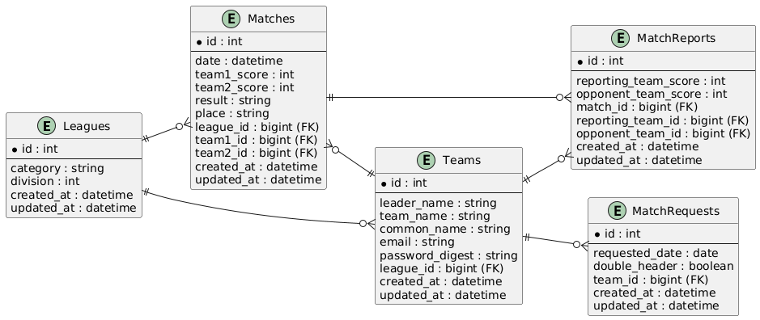

# VSmanager

### URL:[VSmanager](https://vsmanager-baseball.com)

※以下のメールアドレスとパスワードでログインできます

管理者  
メールアドレス: `email11@example.com`  
パスワード: `password`

チーム監督  
メールアドレス: `email22@example.com`  
パスワード: `password`

## サービス概要

「VSmanager」は、草野球大会の運営を効率化するための対戦管理アプリです。  
現在、多くの草野球大会では、試合の申し込みや対戦組み合わせの決定、試合結果の報告などの業務を FAX や音声ダイヤルを利用して行っています。しかし、これらの方法では手書きで書類を作成したり、音声ダイヤルを聞き取って内容を記録したりと、多くの手間がかかるうえ、情報の伝達ミスや処理の遅れが発生しやすいという課題があります。  
このアプリでは、大会運営者やチーム運営者向けに、試合の申し込み、対戦組み合わせの決定、対戦情報の表示、試合結果の報告・閲覧といった機能を提供しています。  
これにより、煩雑な手続きを削減し、スムーズな大会運営をサポートします。

## サービスのきっかけ

現在、私が運営する草野球チームが加盟するリーグでは、試合の申し込みに FAX、組み合わせの確認に音声ダイヤルを使用しています。この運用には、以下のような課題があります。

- 手書きで申し込みを作成・修正する必要があり、煩雑。
- FAX を持っていないチームは、コンビニ等に送りに行かなければならず、手間やコストがかかる。
- 毎週 10 分前後の時間、電話を繋いで音声を聞かなければならなず、時間と電話代がかかる。
- 聞き逃してしまったり聞き取れなかった場合は、最初から聞き直しになり、さらに時間とコストがかかる。
- 組み合わせ発表の曜日は回線が混み合っていて、電話が繋がらず、確認に時間がかかってしまう。

このように、現行の方法では運営者・チーム運営者ともに負担が大きく、非効率な状況です。そこで、Web 上で申し込みや試合情報を管理できる仕組みを導入することで、FAX や電話を使う必要をなくし、スムーズな運営を実現します。
大会運営者は申し込みや対戦組み合わせの管理が簡単になり、チーム運営者も PC でいつでも情報を確認できるため、余計な手間を省き、試合に集中できる環境が整います。
「試合の準備ではなく、試合そのものに集中できるように」――そんな思いから、草野球大会の対戦管理アプリ「VSmanager」を開発しました。

## 機能(表示画面)一覧

VSmanager では、大会管理者と各チームの監督が、それぞれ異なるアカウント権限を持ち、役割に応じた操作ができるようになっています。

#### チーム監督

- チーム情報表示
- 試合申し込み

#### 管理者

- 対戦組合せ作成
- 対戦一覧の表示

#### 共通

- ログイン
- 試合情報表示

<!-- ### 試合情報ページ(ユーザー)

<table style="width:100%;">
  <tr>
    <td></td>
  </tr>
  <tr>
    <td>今週の時チームの試合が組まれているか確認することができます。今週の試合の申し込みと試合結果を報告するページに遷移するボタンがあります。</td>
  </tr>
</table> -->

<table>
  <tr>
    <td align="center"><b>対戦管理ページ(管理者)</b></td>
    <td align="center"><b>今週の試合情報(共通)</b></td>
  </tr>
  <tr>
    <td></td>
    <td></td>
  </tr>
  <tr>
    <td>大会管理者が各チームからの試合申し込みを元に、組み合わせを決定するページです。試合申し込みがあった各チームの情報が上部に表示されます。下部で対戦組み合わせ、試合会場、試合開始時間を選択して組み合わせ決定ボタンを押すと今週の試合情報に反映されます。</td>
    <td>管理者が組み合わせを決定すると、今週行われる全試合の詳細リストが表示されます。</td>
  </tr>
</table>

<table>
  <tr>
    <td align="center"><b>チーム情報ページ(チーム監督)</b></td>
    <td align="center"><b>試合申し込みページ(チーム監督)</b></td>
  </tr>
  <tr>
    <td></td>
    <td></td>
  </tr>
  <tr>
    <!-- <td>ログイン後に表示されるページです。大会管理者からのお知らせ、チーム名、所属しているリーグ、対戦成績が確認できます。お知らせには対戦の組み合わせが確定したことなどが表示されます。</td> -->
    <td>ログイン後に表示されるページです。チーム名、所属しているリーグ、対戦成績が確認できます。</td>
    <td>試合の申し込みができるページです。申請、取り消し、ダブルヘッダー(1日に２試合組みたい場合の対応)の有無を選択して管理者側に送信することができます。</td>
  </tr>
</table>

<table style="width:50%;">
  <tr>
    <td align="center"><b>ログインページ</b></td>

  </tr>
  <tr>
    <td></td>

  </tr>
  <tr>
    <td>メールアドレスとパスワードを入力してログインできます。</td>

  </tr>
</table>

## 画面遷移図

## ペルソナ

### 山田 太郎（仮名）: チーム監督

- 年齢\*\*: 32 歳
- **住所**: 東京
- **立場**: 地域の草野球チーム監督
- **背景・状況**:  
  地元の草野球チームで 10 年間運営を担当。  
  チームのスケジュール調整や試合申し込みなど、FAX、電話、手書きの申し込み用紙などアナログな方法で業務を行ってきた。  
  デジタルツールの利用は最低限で、現状の非効率さに頭を悩ませている。

- **悩み**:

  - FAX 送信や電話での連絡に多大な時間と手間がかかるため、シンプルかつ迅速に情報管理・共有できる仕組みが必要。
  - チームの試合申し込みや対戦情報をいつでも簡単に確認できる Web ベースのシステムを求めている。

- **チャレンジしたいこと**:
  - 管理業務の負担軽減により、試合準備やチーム指導により多くの時間を割きたい。
  - ミスや連絡漏れを防ぎ、チーム全体の円滑なコミュニケーションを実現したい。

---

### 佐藤 次郎（仮名）: 管理者

- **年齢**: 50 歳
- **住所**: 東京
- **立場**: 地域草野球大会の運営責任者
- **背景・状況**:  
  複数のチームが参加する大会の運営全般を担当。  
  毎週、多くの試合申し込みを FAX や電話で受け取り、対戦組み合わせの決定に追われている。  
  手作業による情報管理のため、連絡ミスや確認漏れ、試合開始直前の混雑などの問題が発生している。

- **悩み**:

  - 各チームからの試合申し込みを一元管理し、組み合わせ決定や情報更新を効率化したい。
  - 回線の混雑や手作業によるミスを減らし、正確かつ迅速に試合情報を全参加チームに伝えたい。

- **チャレンジしたいこと**:
  - 大会運営の手間を大幅に削減し、運営にかかる時間やコストを低減したい。
  - 参加チーム全体の満足度を向上させ、大会自体のスムーズな進行を実現したい。

## ER 図

<!-- ## インフラ構成図

あとで作ります -->

## 主な使用技術

- フロントエンド
  - 言語: HTML/CSS TypeScript
  - フレームワーク: Next.js(15.0.4) TailwindCSS
  - ライブラリ: React(18.3.1) shadcn/ui jotai Axios
  - ツール: ESLint prettier
- バックエンド
  - 言語: Ruby (3.2.5)
  - フレームワーク: Ruby on Rails (7.1.4.2)
  - ツール: rubocop
- データベース
  - postgreSQL(15)
- インフラ・開発環境
  - Docker
  - Docker Compose
  - Render
  - Vercel
- その他
  - Git
  - GitHub
  - JWT

## 追加実装予定

- 試合結果報告機能
- 運営からの通知機能
- 選手登録機能
- レスポンシブ対応
